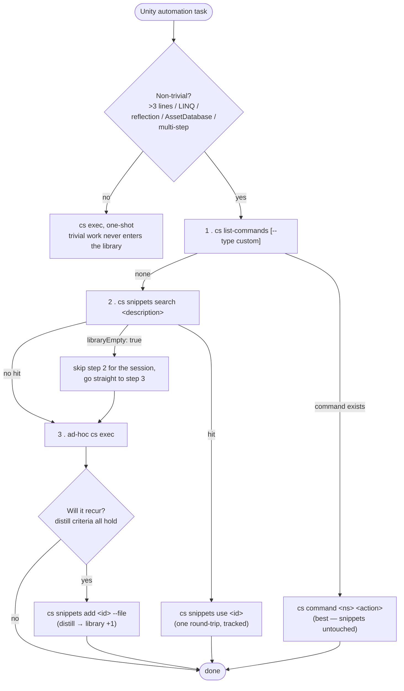
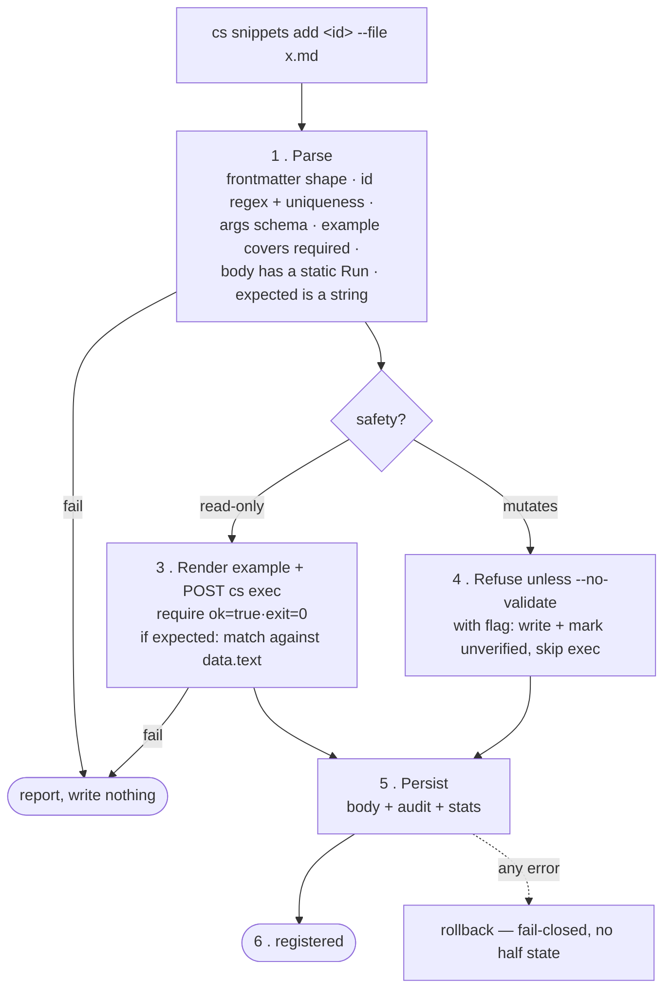
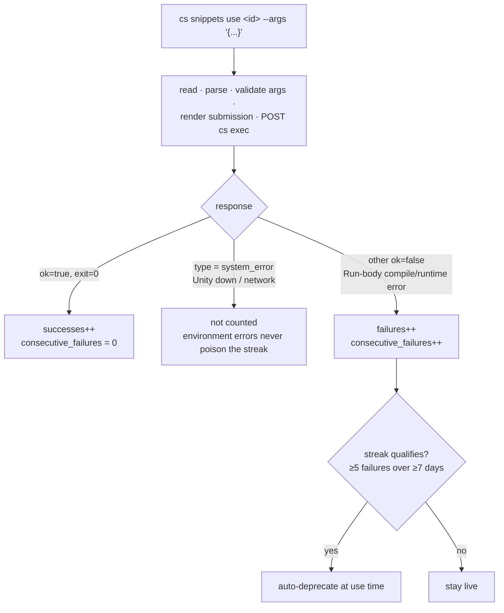
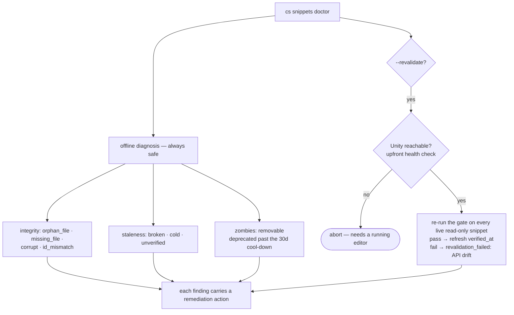
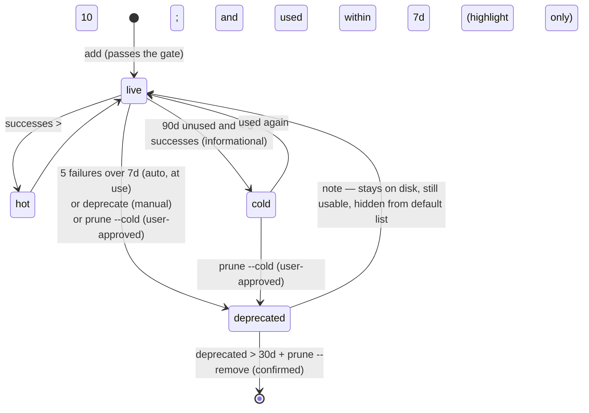

# Self-Evolving Snippet Library

A project-local library of reusable C# snippets, executed through the existing
Roslyn REPL (`cs exec`), discovered and grown by the agent through dedicated
CLI commands and a network of skills.

## Why it exists

The `cs exec` REPL starts a fresh session on every CLI invocation, so any C#
that was debugged into shape — scene queries, asset sweeps, batch workflows —
evaporates the moment the command returns. The expensive part of ad-hoc code
is not writing it once; it is the *write → error → diagnose → retry* round-trip
loop. The snippet library captures a working pattern once, behind a validation
gate, so that future runs collapse that loop into a single `cs snippets use`.

The library is the **third command tier**, fully independent of the other two:

```
┌──────────────────────────┬──────────────────────┬──────────────────────┐
│  cs list-commands         │   cs catalog          │   cs snippets         │
│  Unity in-process registry│   .unity-cli/         │   .unity-cli/         │
│  (C#-compiled, ephemeral) │   catalog.json        │   snippets~/*.md      │
│                           │   (cached subset,     │   (Roslyn eval,       │
│  built-in / custom cmds   │    persistent)        │    persistent)        │
└──────────────────────────┴──────────────────────┴──────────────────────┘
   The three tiers never read each other. Boundaries are navigated by skill
   wording and --help cross-references, not by CLI coupling.
```

"Self-evolving" means the library **grows by agent distillation**: after solving
a non-trivial, recurring task ad-hoc, the agent distills it into a snippet, so
the next occurrence is a library hit instead of a fresh write.

## The skill network

The library is driven by a network of skills, not a single one. Two are
dedicated to it; three existing skills are wired into the same decision chain.

| Skill | Role |
|-------|------|
| **`unity-cli-snippets`** | Operator's manual for *using and growing* the library: decision order, distill criteria, snippet anatomy, safety classes, validation gate, aging rules. |
| **`unity-cli-snippets-audit`** | Operator's manual for *maintaining* the library: drives `cs snippets doctor` and triages its findings into cleanup actions. |
| **`unity-cli-command`** | First stop of the decision order — prefer a built-in / custom command. |
| **`unity-cli-exec-code`** | Last stop — ad-hoc `cs exec` fallback; also prompts post-hoc distillation. |

The two dedicated skills split cleanly: `unity-cli-snippets` owns the production
path (`use` / `add`), `unity-cli-snippets-audit` owns the maintenance path
(`doctor` / `prune`). Keeping them separate prevents maintenance rules from
cluttering everyday use.

### The decision order (the chain that links the skills)

This is the heart of the scheme, hard-coded into `unity-cli-snippets` and
cross-referenced from the two existing skills:



The agent **never** reads or lists `.unity-cli/snippets~/` directly; all access
goes through the CLI, so token cost stays bounded and usage is always tracked.

## Storage layout

```
<project-root>/.unity-cli/
  ├── catalog.json              # pre-existing custom-command cache (unrelated)
  ├── snippets~/                # snippet bodies, one file per snippet (committed)
  │     scene.find_active_in_layer.md
  │     asset.find_unused_materials.md
  ├── snippets-audit.json       # created / verified / deprecated trail (committed)
  └── snippets-stats.json       # successes / failures / streaks (gitignored)
```

Design split: **bodies and audit are committed** (project state), **stats are
not** (they mutate on every `use` and would otherwise create constant PR noise
and merge conflicts). The trailing `~` is defensive — if the directory is ever
copied into `Assets/`, Unity skips `~`-suffixed folders.

## Snippet anatomy

A snippet is frontmatter plus a single `csharp` fenced block:

```markdown
---
id: scene.find_active_in_layer          # dotted, globally unique — the primary key
summary: Find active GameObjects in a layer   # what `search` indexes
safety: read-only                        # read-only | mutates
args:
  - name: layerName
    type: string                         # see the type table below
example:
  layerName: "Default"                   # covers every required arg; used by the gate
# optional: expected: "<string>"         # compared against the textual result
---

```csharp
using System.Linq;
static string Run(string layerName) {    # exactly one `static Run`, matching args order
    return string.Join(",", UnityEngine.Object.FindObjectsOfType<GameObject>()
        .Where(g => g.activeInHierarchy && LayerMask.LayerToName(g.layer) == layerName)
        .Select(g => g.name));
}
```​
```

Authors write plain C#. On submission the CLI wraps the body for isolation —
transparent to the author:

```
   author's body                       single submission posted to cs exec
┌───────────────────┐    render     ┌────────────────────────────────────────────┐
│ using System.Linq; │  ─────────►   │ using System.Linq;                          │
│ static string Run  │               │ static class __Snip_a1b2c3d4e5f60718 {      │
│   (string l){...}  │               │     static string Run(string l){...}        │
└───────────────────┘               │ }                                            │
                                     │ __Snip_a1b2c3d4e5f60718.Run("Default")      │
   args (JSON)                       └────────────────────────────────────────────┘
   {"layerName":"Default"}              wrapper name = sha1(id + body)[:16]
                                        → same snippet → same name (idempotent)
                                        → different / edited snippet → different name
                                        → helpers stay scoped inside the wrapper class
```

### Type substitution

`--args` / `example` JSON values are converted into fully-qualified C# literals
spliced into the generated call line, so the call never depends on the body's
`using` directives.

| `type` | JSON input | Generated literal |
|--------|-----------|-------------------|
| `string` | `"foo"` | `"foo"` (escaped) |
| `int` | `42` | `42` |
| `float` | `3.14` | `3.14f` |
| `bool` | `true` / `false` | `true` / `false` |
| `vector2` | `[x, y]` | `new UnityEngine.Vector2(x, y)` |
| `vector3` | `[x, y, z]` | `new UnityEngine.Vector3(x, y, z)` |
| `vector4` | `[x, y, z, w]` | `new UnityEngine.Vector4(x, y, z, w)` |
| `color` | `[r, g, b]` / `[r, g, b, a]` | `new UnityEngine.Color(r, g, b, a)` (alpha defaults to 1) |
| `string[]` / `int[]` / `float[]` | `[...]` | `new T[] { ... }` |

No `Quaternion` (use `vector3` Euler or `vector4` raw and build it inside `Run`),
no nested arrays, and no raw-expression splice (it would bypass the type system
and the safety classification). Optional args declare a `default:` field.

## Safety classes

| Class | Meaning | Validation |
|-------|---------|------------|
| `read-only` | pure query — no scene / asset / file / setting changes | auto-validated by the gate |
| `mutates` | any side effect (scene, assets, files, `ProjectSettings`, refreshes, domain reload) | cannot be auto-validated; `add` / `update --file` require `--no-validate`, the audit is marked `unverified: true`, and `list` flags the row |

Classification is the author's responsibility; the CLI does not infer it. The
two-class model is deliberate — an earlier "undoable" class was dropped because
`Undo.PerformUndo()` is not a reliable rollback oracle.

## CLI surface

```
read    ── list    [--safety S] [--include-deprecated] [--sort hot|cold|recent]
        ── show    <id>
        ── search  <query> [--top N]        # decision step 2; empty lib → libraryEmpty
        ── stats   [--id <id>]

execute ── use     <id> [--args '<json>'] [--dry-run]   # the only command that writes stats

write   ── add     <id> --file <md> [--no-validate]     # distill entry; runs the gate
        ── update  <id> [--file <md>] [--set k=v]        # --file revalidates; --set = non-exec fields only
        ── deprecate <id> [--reason ...] [--supersede <new>]

maintain── prune   [--cold] [--max-age-days N] [--remove] [--dry-run]
        ── doctor  [--revalidate]            # anti-rot health check
```

## Core flows

### Distill / `add` — how the library grows (validation gate)



The gate is a **smoke test, not a correctness oracle** — it only proves the
snippet runs without crashing on the `example` inputs. For a stronger check, add
an `expected` string: validation also compares it against the textual REPL
result (the `ToString()` of `Run`'s return value in `data.text`). The exec
endpoint never returns structured JSON, so snippets wanting a meaningful
assertion return a formatted string from `Run`.

### `use` — invoke, track, auto-deprecate



Only Run-body errors count toward the failure streak. Environment errors are
excluded so offline retries cannot auto-deprecate a perfectly good snippet.

### `doctor` — anti-rot maintenance

A library rots four ways: **API drift** (a Unity upgrade breaks bodies),
**integrity drift** (files and audit entries diverge through merges or hand
edits), **staleness**, and **zombie deprecations**. `doctor` detects all four;
the `unity-cli-snippets-audit` skill triages the findings.



`doctor` never touches usage stats — diagnostics are not invocations. The two
destructive cleanup paths (`prune --cold`, `prune --remove`) always require user
confirmation; the audit skill enforces that rule.

## Lifecycle



Default `prune` is a **no-op on live snippets** — it only acts on already-
deprecated entries. Auto-deprecation happens at `use` time, never from `prune`.
A superseding snippet records the replacement via
`deprecate <old> --supersede <new>` (`audit.superseded_by`).

## Aging policy

| State | Trigger | Default action |
|-------|---------|----------------|
| Cold | `last_used > 90d ago && successes < 3` | informational (`list --sort cold`); `prune --cold` to retire |
| Broken | `consecutive_failures >= 5 && streak span >= 7d` | auto-deprecate at `use` time |
| Hot | `successes > 10 && used within 7d` | informational (`list --sort hot`) |

The broken rule requires both a count (5 strikes) and a time spread (≥ 7 days),
so transient flakes in a single bad-Unity-state session do not trip it.

## Implementation modules

| Module | Responsibility |
|--------|----------------|
| `cli/snippets/render.py` | Typed-literal substitution + unique class wrapper + call generation |
| `cli/snippets/store.py` | Frontmatter parsing, schema validation, on-disk file IO |
| `cli/snippets/validate.py` | Validation gate (read-only auto, mutates refusal, optional `expected`) |
| `cli/snippets/stats.py` | Audit / stats IO, aging classification, use-time auto-deprecation |

`cs snippets` subcommands in `cli/cs.py` wire these together. Everything is pure
Python standard library — no external dependencies, consistent with the rest of
the CLI.
